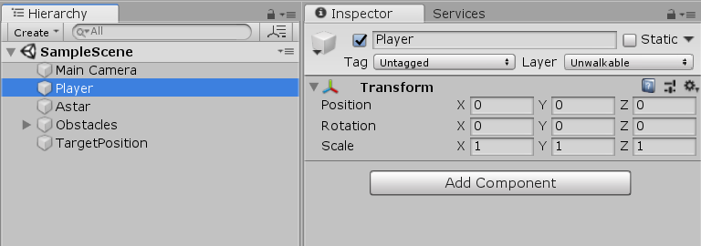
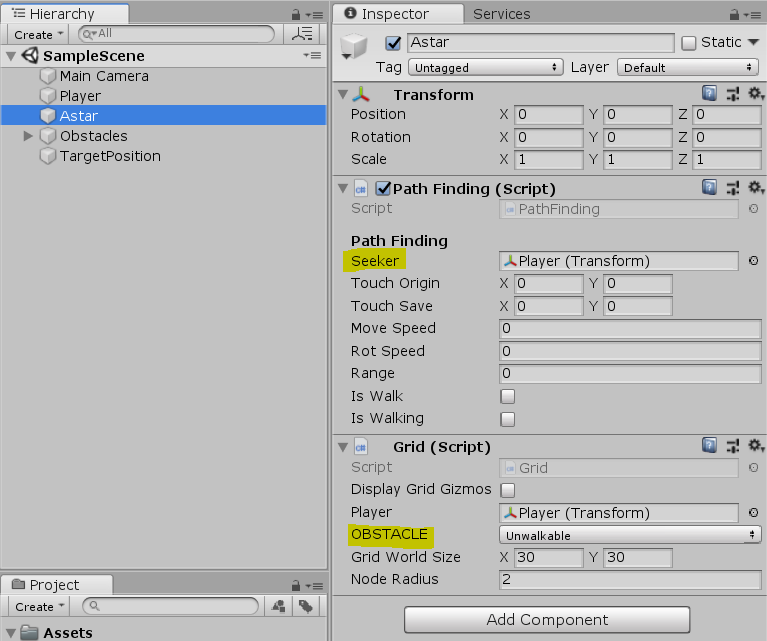
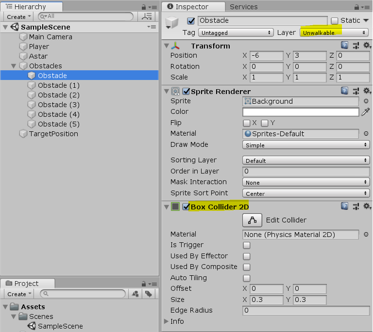
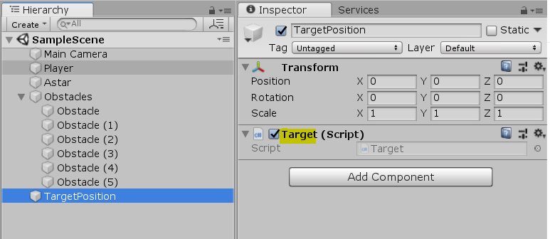
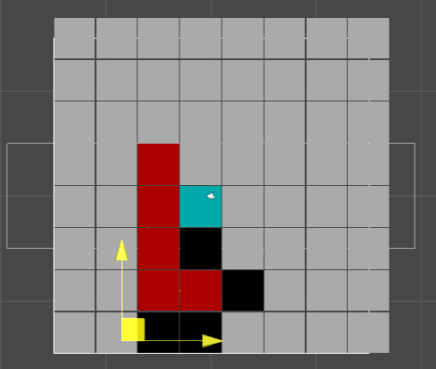

Simple A* algorithm 
===============
Unity 엔진( Unity 2018.3.0f2 (64-bit) ) 으로 구현한 A* 알고리즘 프로젝트 파일 입니다.

이 기술은 모바일 게임 "수몰지구"의 길찾기 알고리즘에 사용되었습니다.

PathFinding.cs : https://github.com/SeongjinBak/simple-Astar-algorithm/blob/master/simple_astar_algorithm/Assets/PathFinding.cs

수몰지구 다운로드 링크 : https://play.google.com/store/apps/details?id=com.EXP.EXP_SooMolJiGoo&hl=ko

youtube 링크 : https://youtu.be/eHvMHx2CLUQ

참고 동영상 : https://www.youtube.com/watch?v=-L-WgKMFuhE

스크립트 개요
--
	1. Node.cs : 격자의 Cell 입니다.
	2. Grid.cs : 지정된 크기만큼 화면을 Node 배열로 채웁니다. 
	3. Pathfinding.cs : A* 알고리즘 입니다. Grid를 활용하여 Target까지의 최단거리를 찾습니다.

적용 방법
--
	1. Player 게임오브젝트를 생성합니다.

	2. Astar - Path Finding의 Seeker에 Player를, Grid에 Unwalkable 레이어를 설정합니다.
 

	3. Obstacle의 layer를 Unwalkable로 지정 후 BoxCollider를 추가합니다.
 
 
 	4. Target에 Target.cs를 부착합니다. 
 
 
 	5. Target Game Object의 위치에 따라 A*의 Target이 설정됩니다. Scene View에서 Target의 위치를 변화시켜서 확인할 수 있습니다.
 
 